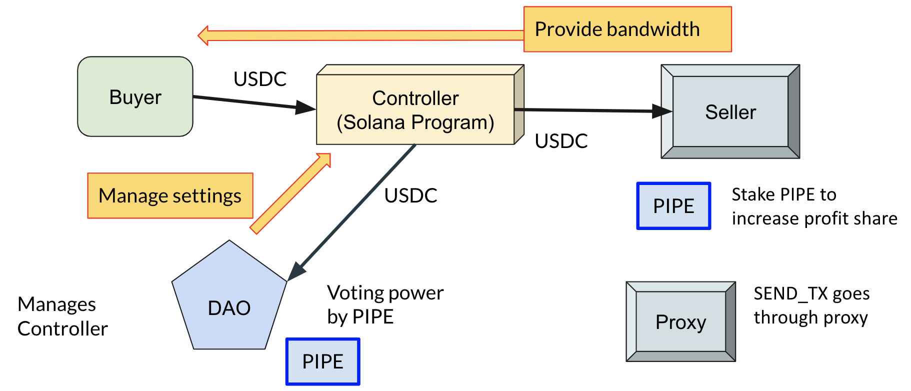

# Go-Staker

Go-Staker is a Go library that interacts with the [Solpipe](https://solpipe.io) Solana program.  The Solpipe Solana program allows for the buying and selling of transaction bandwidth.  The buyers are developers and the sellers are staked-validators.

This library's main external dependency is to [Solana-go](https://github.com/gagliardetto/solana-go), forked for convenience [at this repository](https://github.com/SolmateDev/solana-go).

# Bandwidth

Bandwidth defined to be TPS allowed via the JSON RPC send_tx call.  The bandwidth does not refer to guaranteed space in a block.  [The main reference issue on Github](https://github.com/solana-labs/solana/issues/23211) describes QUIC as implementing a handshake and QoS as affixing a rate limit on transactions arriving at the lead validator.

The core assumption with Solpipe is that stake-validators will run the vanilla Solana validator code and run a proxy in front of the JSON RPC that intercepts send_tx calls. 

## Flow

There is a buyer who wants to send transactions to the leader to be processed. And there is a seller who wants to earn revenue by processing transactions.  The rough overview is as follows:

1. Seller creates *Bid Table* for its validator.  The seller's validator TPS is not relevant here.  The seller's total TPS will be divided by 1000.  Allotments to buyers are done as deposit ratios measured to the 1/1000 of the validator's TPS.
1. Seller creates bidding *Periods*
1. Buyers deposit funds, bidding on a allotment. 
1. Cranker (anyone) cranks and pushes Periods forward. Once a new Period starts, bandwidth fees are deducted and buyers can start sending transactions to the seller.
1. Buyers find the seller's proxy address via Solpipe program.
1. Buyer authenticates using the ed5519 private key to authenticate with the seller's proxy address

## Components

| *Name* | *User* | *Description* |
|--------------|-----------|------------|
| [proxy](./proxy/proxy.go) | Seller | creates a Grpc endpoint that listens over TCP HTTP/2 for connections from buyers.  It routes transactions to the staked-validator via JSON-RPC.  Rate limiting is done automatically with bandwidth allotments updated in real time from the Solpipe Program accounts. [See Seller.md for details](./docs/Seller.md) |
| [bidder](./bidder/bidder.go) | Buyer | automatically deposits funds such that the that the target TPS is allotted upon start of a new Period. [See Buyer.md for details](./docs/Buyer.md) |
| [cranker](./cranker/cranker.go) | Anyone | push Periods forward.  On start of new Period, bandwidth is alloted in parts of 1000, bandwidth fees are deducted |

